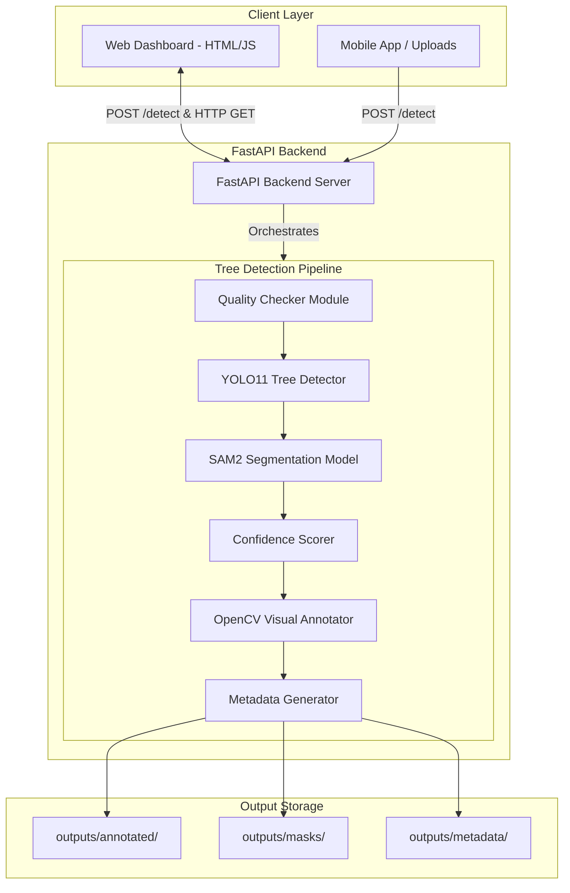
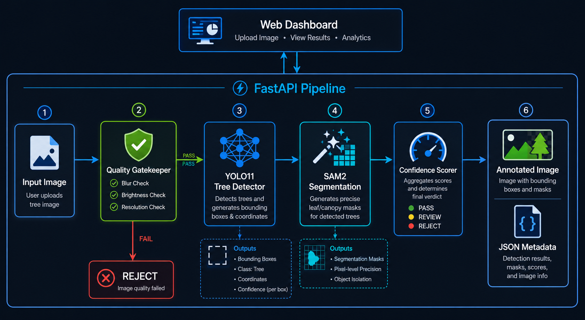
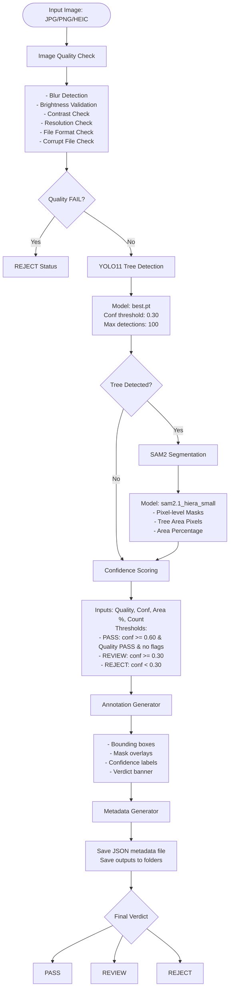
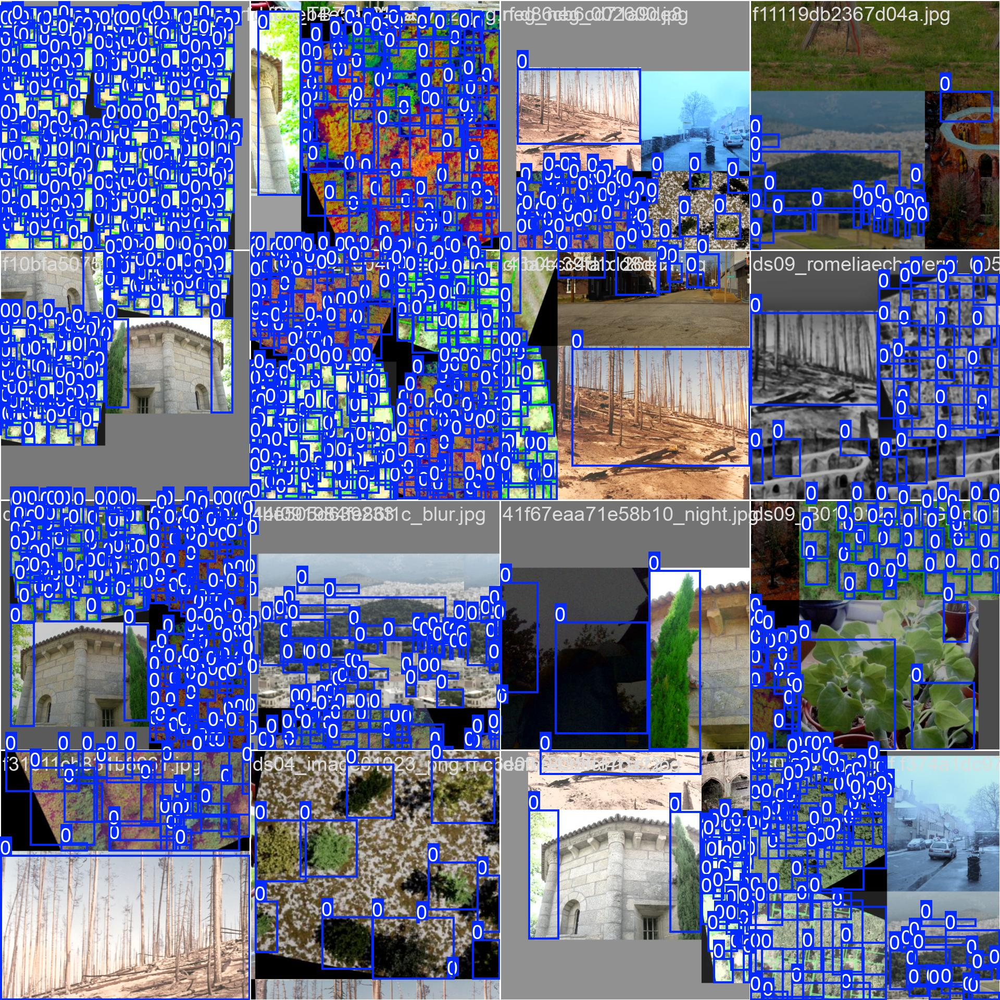
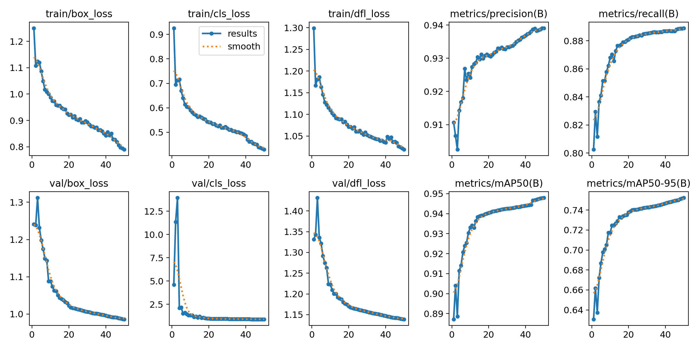
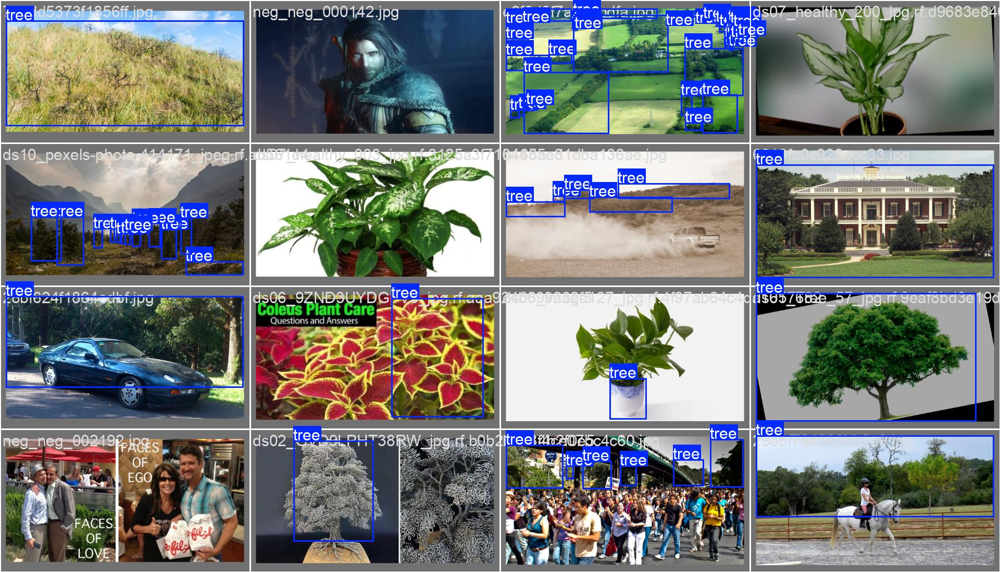

# 🌳 Tree Detection & Localization System

AI-powered tree detection and localization pipeline for validating tree-tagging images before they are approved as digital tree assets — powered by a custom-trained **YOLO11** model and **SAM2** segmentation, served through a **FastAPI** backend with a live web dashboard.

---

## Table of Contents

- [Overview](#overview)
- [Problem Statement](#problem-statement)
- [High-Level Architecture](#high-level-architecture)
- [Pipeline Sequence Diagram](#pipeline-sequence-diagram)
- [Processing Flow Diagram](#processing-flow-diagram)
- [Dataset](#dataset)
- [Model Training & Performance](#model-training--performance)
- [Key Features](#key-features)
- [Project Structure](#project-structure)
- [Technology Stack](#technology-stack)
- [Installation & Setup](#installation--setup)
- [Downloading Model Weights](#downloading-model-weights)
- [Running the Pipeline](#running-the-pipeline)
- [Running the API & Dashboard](#running-the-api--dashboard)
- [API Endpoints](#api-endpoints)
- [Sample API Response](#sample-api-response)
- [Validation Logic](#validation-logic)
- [Configuration](#configuration)
- [Known Limitations](#known-limitations)
- [Future Improvements](#future-improvements)
- [Technical Approach](#technical-approach)
- [Security & .gitignore](#security--gitignore)
- [Contributing](#contributing)
- [License](#license)
- [Author](#author)

---

## Overview

This project provides an automated image validation and tree detection workflow for tree-tagging applications. It analyzes uploaded field images and determines:

- Whether one or more **trees are present**
- The **location of detected trees** (bounding boxes)
- **Pixel-level segmentation masks** for each tree
- **Image quality assessment** (blur, brightness, contrast, resolution)
- **Detection confidence score**
- Final **validation verdict** → `PASS` / `REVIEW` / `REJECT`

The goal is to improve **digital tree asset quality** by preventing non-tree, low-quality, or ambiguous images from entering the approval workflow.

---

## Problem Statement

Tree-tagging applications rely on manually captured field images. Common quality issues include:

| Issue | Impact |
|---|---|
| Non-tree images accidentally uploaded | Invalid tree records |
| Blurry or low-quality images | Unreliable detection |
| Partial tree captures | Incomplete localization |
| Multiple trees in one image | Ambiguous records |
| Poor lighting / overexposure | Reduced model accuracy |

These issues result in **incorrect tree records** affecting downstream carbon offset calculations and reporting. This system introduces an AI-assisted validation layer that automatically verifies tree presence and location **before approval**.

---

## High-Level Architecture

The components and data flow of the Tree Detection and Localization system:



### Architecture Diagram


---

## Pipeline Sequence Diagram

The interaction sequence between the user, dashboard, FastAPI backend, and underlying AI pipeline:

```mermaid
sequenceDiagram
    actor User as Planter User
    participant Dash as Web Dashboard (app.js)
    participant API as FastAPI Gateway (app.py)
    participant Pipe as Pipeline Orchestrator (pipeline.py)
    participant Models as ML Models (YOLO & SAM2)

    User->>Dash: Select/Drop Image File
    Dash->>Dash: Render local image preview
    Dash->>API: HTTP POST /detect (Multipart Form)
    API->>API: Save uploaded image to uploads/ folder
    API->>Pipe: Execute pipeline.run(image_path)
    
    rect rgb(30, 30, 40)
        Note over Pipe,Models: Core AI Pipeline Execution
        Pipe->>Pipe: Validate format and resolution (Quality Checker)
        Pipe->>Models: Run YOLOv11 detector
        Models-->>Pipe: Return bounding boxes & confidences
        Pipe->>Models: Run SAM2 Segmentor (using boxes as prompts)
        Models-->>Pipe: Return pixel segment masks
        Pipe->>Pipe: Score overall confidence & validation state (Confidence Scorer)
        Pipe->>Pipe: Save annotated image & JSON files to outputs/
    end
    
    Pipe-->>API: Return pipeline output metadata paths
    API-->>Dash: HTTP response (JSON with paths)
    Dash->>Dash: Fetch full JSON metadata & results
    Dash->>Dash: Render annotated image side-by-side
    Dash->>Dash: Populate metrics grid, details table, & badges
    Dash-->>User: Display final visual validation results
```



---

## Processing Flow Diagram

The logical step-by-step flowchart of the tree validation pipeline:



---

## Dataset

### Custom Tree Detection Dataset

The YOLO11 model was trained on a **large-scale, custom curated dataset** built specifically for outdoor tree detection in real-world field conditions.

| Split | Count |
|---|---|
| Positive (Tree) Images | **50,000+** |
| Negative (Non-Tree) Images | **5,000+** |
| **Total** | **~55,000 images** |

### Positive Dataset — Tree Classes

The positive dataset includes diverse tree types and conditions:

- Large outdoor trees (single and multi-tree)
- Palm trees, saplings, shrubs
- Dense forest / canopy images
- Trees in varying seasons (summer, monsoon, dry)
- Field photos taken by mobile devices
- Multiple lighting conditions (morning, afternoon, night)
- Partial occlusion, partial canopy captures
- Potted trees

### Negative Dataset — Hard Negatives

The negative dataset contains **5,000+ hard negative images** — visually complex images that the model could easily confuse with trees. This is critical to reduce false positives:

| Negative Category | Description |
|---|---|
| Humans / People | Full body and group photos |
| Vehicles | Cars, trucks, bikes |
| Buildings | Houses, architecture |
| Grass / Crops | Lawns, agricultural fields |
| Indoor Plants | Potted plants, houseplants |
| Shrubs | Bushes without tree trunks |
| Mountains / Rocks | Natural landscape without trees |
| Animals | Horses, cattle in fields |

> **Why hard negatives matter:** Without negative samples, a YOLO model trained only on trees often incorrectly detects plants, bushes, or even people as trees. The 5k hard-negative dataset significantly reduced false positives.

### Dataset Samples and Training Batch


---

## Model Training & Performance

### Model Architecture

| Property | Value |
|---|---|
| Base Model | **YOLO11** (Ultralytics) |
| Training Epochs | 50 |
| Image Size | 640×640 |
| Classes | 1 (`tree`) |
| Framework | PyTorch + Ultralytics |

### Training Metrics

| Metric | Score |
|---|---|
| **Precision** | **0.94 (94%)** |
| **Recall** | ~0.89 (89%) |
| **mAP@50** | ~0.94 |
| **mAP@50-95** | ~0.74 |

### Training Curves Summary

The training graphs show:

- **train/box_loss, cls_loss, dfl_loss** — Smooth, consistent downward curves over 50 epochs, indicating stable learning without overfitting.
- **val/box_loss, val/cls_loss, val/dfl_loss** — Validation losses converge and stabilize, confirming good generalization to unseen images.
- **Precision curve** — Rises sharply and plateaus at **~0.94**, confirming high accuracy in positive detections.
- **Recall curve** — Steadily increases to ~0.89, indicating the model successfully finds most trees.
- **mAP@50** — Reaches ~0.94-0.95, excellent object detection performance.
- **mAP@50-95** — Reaches ~0.74, showing strong performance even at stricter IoU thresholds.

### Training Metrics Plot


### Validation Batch Detections
Below are sample detections on validation batches:


---

## Key Features

### 1. Image Quality Validation

Pre-checks images before AI inference to avoid wasting compute:

| Check | Method | Threshold |
|---|---|---|
| Blur | Laplacian Variance | reject < 50, review < 100 |
| Brightness | Grayscale Mean | dark < 40, overexposed > 220 |
| Contrast | Grayscale Std Dev | low < 20 |
| Resolution | Pixel Dimensions | min 480×480 |
| File Format | Extension check | JPG, JPEG, PNG, HEIC |
| Corruption | OpenCV read check | cannot read = FAIL |

**Output:**
```json
{
  "blur_score": 145.6,
  "blur_status": "acceptable",
  "brightness": "normal",
  "brightness_value": 112.3,
  "contrast": "normal",
  "contrast_value": 58.4,
  "resolution": "1920x1080",
  "resolution_status": "acceptable",
  "file_format": "jpg",
  "file_valid": true,
  "overall_quality": "PASS",
  "quality_flags": []
}
```

### 2. YOLO11 Tree Detection

Detects visible trees using the custom-trained `best.pt` model:

- Detects single and multiple trees
- Produces bounding boxes (`x_min, y_min, x_max, y_max`)
- Assigns confidence score per detection
- Minimum confidence threshold: **0.30**

**Output:**
```json
{
  "tree_detected": true,
  "tree_count": 2,
  "detections": [
    {
      "detection_id": 1,
      "class_label": "tree",
      "confidence": 0.8731,
      "bounding_box": { "x_min": 120, "y_min": 80, "x_max": 640, "y_max": 720 }
    }
  ]
}
```

### 3. SAM2 Tree Segmentation

Provides **pixel-level segmentation masks** for each detected tree using **Meta SAM2.1 (sam2.1_hiera_small)**:

- Uses YOLO bounding boxes as prompt inputs to SAM2
- Generates precise binary masks per tree
- Calculates tree area in pixels and percentage of image
- Falls back to bounding-box mask if SAM2 is unavailable

**Output:**
```json
{
  "mask_available": true,
  "tree_area_pixels": 320000,
  "image_total_pixels": 2073600,
  "tree_area_percentage": 15.43
}
```

### 4. Confidence Scoring & Validation

Combines quality + detection + segmentation into a final verdict:

| Condition | Status |
|---|---|
| No tree detected | `REJECT` |
| Confidence ≥ 0.60 AND Quality = PASS AND no flags | `PASS` |
| Confidence ≥ 0.30 | `REVIEW` |
| Confidence < 0.30 | `REJECT` |

### 5. Annotation Generation

Draws visual output overlays on the original image:
- Bounding boxes around detected trees
- Segmentation mask overlay (semi-transparent green)
- Confidence score label per tree
- Validation status banner (PASS / REVIEW / REJECT)

### 6. Metadata Generation

Creates a structured JSON file saved to `outputs/metadata/` containing quality, detection, segmentation, and scoring results.

### 7. Web Dashboard

A live review dashboard served at `http://localhost:8000`:
- Drag-and-drop or click-to-upload images
- Side-by-side original vs annotated comparison
- Real-time detection metrics (tree count, confidence, quality, validation status)
- Detailed detection table with bounding box coordinates
- Quality breakdown pills
- Direct links to annotated images and JSON metadata
- Built with HTML5, JavaScript, and Tailwind CSS

---

## Project Structure

```
tree-detection-localization/
│
├── api/
│   └── app.py                  # FastAPI application (endpoints + dashboard serving)
│
├── dashboard/
│   ├── index.html              # Review dashboard UI
│   ├── css/
│   │   └── style.css           # Custom styles
│   └── js/
│       └── app.js              # Dashboard client logic
│
├── docs/
│   ├── approach.md             # Detailed technical approach documentation
│   └── images/                 # Architecture diagrams & training plots
│
├── models/
│   ├── best.pt                 # Custom YOLO11 weights (not committed to Git)
│   ├── sam2/
│   │   ├── checkpoints/
│   │   │   └── sam2.1_hiera_small.pt  # SAM2 weights (not committed to Git)
│   │   └── configs/
│   │       └── sam2.1_hiera_s.yaml    # SAM2 config
│   └── sam2_repo/              # SAM2 source repo (cloned at setup)
│
├── outputs/
│   ├── annotated/              # Annotated output images
│   ├── masks/                  # Tree segmentation masks
│   └── metadata/               # JSON detection results
│
├── src/
│   ├── __init__.py             # Package exports
│   ├── config.py               # All thresholds, paths, and configuration
│   ├── pipeline.py             # Main orchestration pipeline
│   ├── quality_checker.py      # Image quality validation module
│   ├── tree_detector.py        # YOLO11 detection module
│   ├── segmentation.py         # SAM2 segmentation module
│   ├── confidence_scorer.py    # Scoring and validation logic
│   ├── annotation_generator.py # Output image annotation
│   └── metadata_generator.py   # JSON metadata output
│
├── uploads/                    # Temporary image upload storage
│
├── .gitignore                  # Git exclusions
├── LICENSE                     # MIT License
├── objectives.md               # Challenge objectives
├── README.md                   # This file
├── requirements.txt            # Python dependencies
└── run.py                      # Convenience entry point
```

---

## Technology Stack

### AI / ML

| Library | Purpose |
|---|---|
| **YOLO11** (Ultralytics) | Custom-trained tree detection |
| **SAM2** (Meta AI) | Pixel-level tree segmentation |
| **PyTorch** | Deep learning backend |
| **OpenCV** | Image processing and quality checks |
| **NumPy** | Array operations and mask handling |

### Backend

| Library | Purpose |
|---|---|
| **FastAPI** | REST API framework |
| **Uvicorn** | ASGI server |
| **python-multipart** | File upload support |

### Frontend

| Technology | Purpose |
|---|---|
| **HTML5** | Dashboard structure |
| **JavaScript (ES6+)** | Client-side logic |
| **Tailwind CSS** (CDN) | Utility-first styling |
| **Inter** (Google Fonts) | Typography |

---

## Installation & Setup

### 1. Clone Repository

```bash
git clone https://github.com/nirajkumardangi/tree-detection-localization.git
cd tree-detection-localization
```

### 2. Create Virtual Environment

**Windows:**
```bash
python -m venv venv
venv\Scripts\activate
```

**Linux / macOS:**
```bash
python3 -m venv venv
source venv/bin/activate
```

### 3. Install Dependencies

```bash
pip install -r requirements.txt
```

### 4. Install SAM2

```bash
git clone https://github.com/facebookresearch/sam2.git models/sam2_repo
cd models/sam2_repo
pip install -e .
cd ../..
```

---

## Downloading Model Weights

Model weight files (`.pt`) are **not committed to this repository** because they are large binary files.

### YOLO11 Custom Weights (`best.pt`)

This is the **custom-trained** model (94% precision). Request access from the project maintainer or retrain using your dataset:

```bash
# Place the file at:
models/best.pt
```

### SAM2 Weights (`sam2.1_hiera_small.pt`)

Download directly from Meta AI:

```bash
# Windows PowerShell
Invoke-WebRequest -Uri "https://dl.fbaipublicfiles.com/segment_anything_2/092824/sam2.1_hiera_small.pt" -OutFile "models/sam2/checkpoints/sam2.1_hiera_small.pt"

# Linux / macOS
wget https://dl.fbaipublicfiles.com/segment_anything_2/092824/sam2.1_hiera_small.pt -P models/sam2/checkpoints/
```

**Expected directory after download:**
```
models/
├── best.pt
└── sam2/
    ├── checkpoints/
    │   └── sam2.1_hiera_small.pt
    └── configs/
        └── sam2.1_hiera_s.yaml
```

---

## Running the Pipeline

### Process a Single Image (Python)

```python
from src.pipeline import TreeDetectionPipeline

pipeline = TreeDetectionPipeline()
result = pipeline.run("path/to/your/image.jpg")

print(result["status"])          # PASS / REVIEW / REJECT
print(result["annotated_image"]) # Path to annotated output
print(result["metadata"])        # Path to JSON metadata
```

---

## Running the API & Dashboard

### Option 1: Using the convenience entry point

```bash
python run.py
python run.py --host 0.0.0.0 --port 8000 --reload
```

### Option 2: Using uvicorn directly

```bash
uvicorn api.app:app --reload
```

| Service | URL |
|---|---|
| Dashboard | http://localhost:8000 |
| API Docs (Swagger) | http://localhost:8000/docs |
| Health Check | http://localhost:8000/health |

---


## API Endpoints

| Method | Endpoint | Description |
|---|---|---|
| `GET` | `/` | Serve web dashboard |
| `GET` | `/health` | Health check |
| `POST` | `/detect` | Upload image and run full pipeline |
| `GET` | `/results` | List all saved detection results |
| `GET` | `/results/{file_name}` | Get a specific detection result JSON |

### POST /detect

```bash
curl -X POST http://localhost:8000/detect \
  -F "file=@path/to/tree_image.jpg"
```

---

## Sample API Response

```json
{
  "image_id": "a3f1c20d-4e92-4a7b-b8c1-1234567890ab",
  "status": "PASS",
  "annotated_image": "outputs/annotated/a3f1c20d_annotated.jpg",
  "metadata": "outputs/metadata/a3f1c20d.json"
}
```

**Full metadata JSON:**

```json
{
  "image_name": "a3f1c20d.jpg",
  "quality": {
    "blur_score": 145.6,
    "blur_status": "acceptable",
    "brightness": "normal",
    "brightness_value": 112.3,
    "contrast": "normal",
    "contrast_value": 58.4,
    "resolution": "1920x1080",
    "resolution_status": "acceptable",
    "file_format": "jpg",
    "file_valid": true,
    "overall_quality": "PASS",
    "quality_flags": []
  },
  "detection": {
    "tree_detected": true,
    "tree_count": 1,
    "detections": [
      {
        "detection_id": 1,
        "class_label": "tree",
        "confidence": 0.8731,
        "bounding_box": {
          "x_min": 120, "y_min": 80, "x_max": 640, "y_max": 720
        }
      }
    ]
  },
  "segmentation": {
    "mask_available": true,
    "tree_area_pixels": 320000,
    "image_total_pixels": 2073600,
    "tree_area_percentage": 15.43,
    "mask_files": ["outputs/masks/a3f1c20d_mask_1.png"],
    "mask_file": "outputs/masks/a3f1c20d_mask_1.png"
  },
  "score": {
    "validation_status": "PASS",
    "confidence": 0.8731,
    "flags": []
  },
  "annotated_image": "outputs/annotated/a3f1c20d_annotated.jpg"
}
```

---

## Validation Logic

| Status | Criteria |
|---|---|
| **PASS** | Confidence ≥ 0.60 AND Quality = PASS AND no warning flags |
| **REVIEW** | Confidence ≥ 0.30 (with optional flags) |
| **REJECT** | No tree detected OR confidence < 0.30 OR quality = FAIL |

### Validation Flags

| Flag | Meaning |
|---|---|
| `no_tree_detected` | YOLO found no trees |
| `tree_too_small` | Tree area < 5% of image |
| `poor_image_quality` | Quality check returned FAIL |
| `multiple_trees_detected` | More than one tree found |
| `very_blurry` | Blur score < 50 |
| `resolution_too_low` | Image smaller than 480×480 |
| `too_dark` | Brightness mean < 40 |
| `overexposed` | Brightness mean > 220 |
| `low_contrast` | Contrast std dev < 20 |

---

## Configuration

All thresholds and paths are centralized in [`src/config.py`](src/config.py):

```python
# Model paths
MODEL_PATH = "models/best.pt"
SAM2_CHECKPOINT = "models/sam2/checkpoints/sam2.1_hiera_small.pt"
SAM2_CONFIG = "configs/sam2.1/sam2.1_hiera_s"

# Detection
MIN_DETECTION_CONFIDENCE = 0.30
MAX_DETECTIONS = 100

# SAM2
USE_SAM2 = True

# Scoring thresholds
PASS_CONFIDENCE = 0.60
REVIEW_CONFIDENCE = 0.30
MIN_TREE_AREA_PERCENTAGE = 5

# Quality thresholds
MIN_WIDTH = 480
MIN_HEIGHT = 480
BLUR_REJECT_THRESHOLD = 50
BLUR_REVIEW_THRESHOLD = 100
BRIGHTNESS_DARK_THRESHOLD = 40
BRIGHTNESS_BRIGHT_THRESHOLD = 220
CONTRAST_LOW_THRESHOLD = 20

# Output directories
ANNOTATED_OUTPUT_DIR = "outputs/annotated"
METADATA_OUTPUT_DIR = "outputs/metadata"
MASK_OUTPUT_DIR = "outputs/masks"
```

---

## Known Limitations

- Dense forests may produce **overlapping detections** with low individual confidence
- Small saplings may **not be detected** reliably at minimum thresholds
- Night-time images or images with heavy shadows reduce detection accuracy
- Heavy occlusion may impact SAM2 segmentation quality
- The model was trained primarily on **outdoor field photos** — aerial/drone views may underperform
- CPU inference is significantly slower (~5-15s per image vs ~50ms on GPU)
- Single image per API request (no batch processing yet)

---

## Future Improvements

- 🌿 **Tree Species Classification** — Multi-class YOLO model
- 📏 **Height Estimation** — Using depth estimation models
- 🌍 **Carbon Sequestration Estimation** — Area + species-based calculation
- 📍 **Geospatial Validation** — GPS coordinate cross-checking
- ⚡ **ONNX Model Export** — For edge device inference
- 📱 **Mobile / On-Device Inference** — TFLite or CoreML deployment
- 📦 **Batch Processing API** — Process multiple images in one request
- 🔔 **Webhook Callbacks** — Async result delivery
- 🔐 **Authentication** — API key or JWT-based access control

---

## Technical Approach

For a detailed explanation of the technical approach, design decisions, assumptions, limitations, failure cases, and scaling options, see:

📄 **[docs/approach.md](docs/approach.md)**

---

## Security & .gitignore

The following are **excluded from the repository**:

```
models/**/*.pt        # Large model weight files
models/**/*.pth
models/**/*.onnx
models/sam2_repo/     # SAM2 source (cloned at setup)
venv/                 # Python virtual environment
outputs/annotated/*   # Generated output images
outputs/masks/*
outputs/metadata/*
uploads/*             # Uploaded images
images/**             # Sample / test images
*.env                 # Environment variable files
credentials.json
```

> ⚠️ **Never commit** model weights, geo-tagged images, farm location data, API keys, or credentials.

---

## Contributing

1. Fork the repository
2. Create a feature branch (`git checkout -b feature/your-feature`)
3. Commit your changes (`git commit -m 'Add your feature'`)
4. Push to the branch (`git push origin feature/your-feature`)
5. Submit a Pull Request

**Guidelines:**
- Keep the implementation focused on tree detection and localization
- Do not commit private images, precise location data, credentials, or large generated datasets
- Include setup and running instructions for any new features
- Include sample output using safe, open, synthetic, or approved images
- Explain your assumptions and known limitations

---

## License

This project is licensed under the **MIT License** — see the [LICENSE](LICENSE) file for details.

> **Note:** Model weights trained on proprietary datasets are not covered by this license and are not redistributed. SAM2 model weights are subject to Meta AI's license.

---

## Author

**Niraj Kumar Dangi**
GitHub: [@nirajkumardangi](https://github.com/nirajkumardangi)
